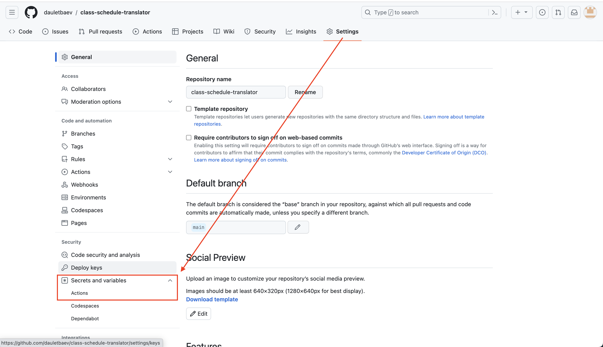
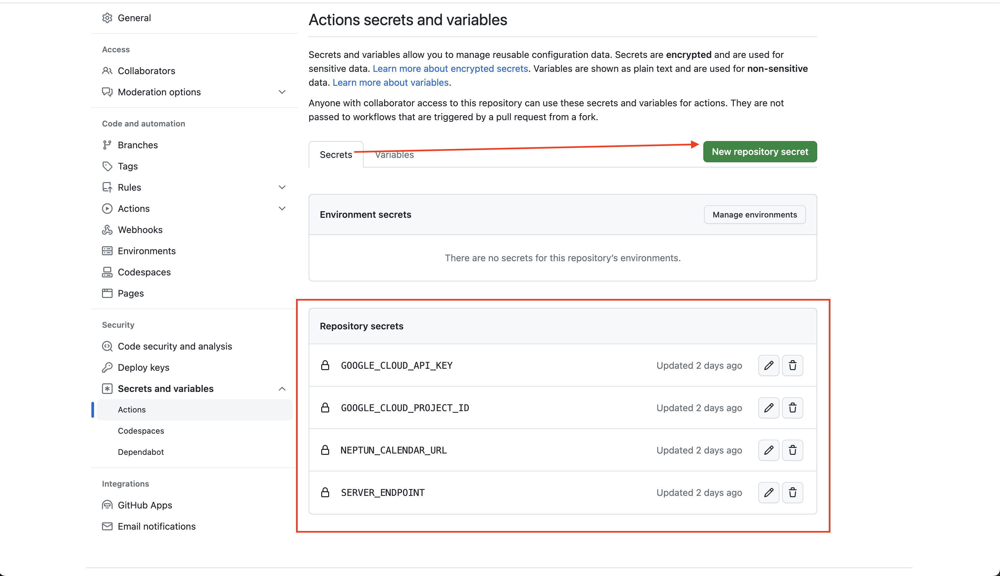

## Automatic Calendar Translator

> Read more here: [Creating an Automatic Calendar Translator: A Quirky Solution for Students Abroad!](https://abat.me/articles/translating-neptun-calendar-for-fun-and-education)

### How to use?

1. Grab your Neptun calendar url

1. Copy contents of `.github/workflows/translate-schedule.yml` file

1. Create a new repository and put the file exact with exact path

1. Add repository secrets for actions

1. Make sure those secrets added
  * `NEPTUN_CALENDAR_URL`
  * `GOOGLE_CLOUD_PROJECT_ID`
  * `GOOGLE_CLOUD_API_KEY`
  * `SERVER_ENDPOINT`

## Find any issues?

Feel free to create issue or PRs
